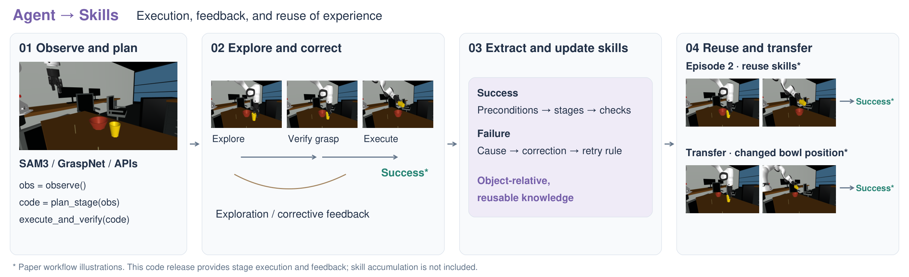

# Real2Gym Agent

[Project](https://real2gym.github.io/) · [Real2Sim](https://github.com/real2gym/Real2Gym) · [Agent](https://github.com/real2gym/R2G_Agent) · [Paper](https://github.com/real2gym/Real2Gym/blob/main/paper/Real2Gym.pdf)

A simulation agent that turns current visual observations into executable manipulation stages, checks the actual feedback, and continues in one task-scoped model session.



[Vector version (SVG)](assets/agent-overview.svg)

This release contains the **C0 continuous stage-code execution path** used in the September 25 experiments. It provides observation, planning, SAM3/GraspNet service adapters, native MuJoCo control, feedback and independent evaluation. It does not load previous-task procedures or build a persistent experience library. The overview illustrates the broader paper workflow; the executable scope here is the stage loop.

## Highlights

- **Closed-loop stages:** one persistent model context per task; bounded multi-action Python per decision.
- **Current evidence:** external and wrist RGB, calibrated metric RGB-D, robot state and explicit gripper contact feedback.
- **Real execution:** robot-only IK followed by native actuator commands; no target-object teleportation or motion replay.
- **Separate evaluation:** task-specific native trace checks remain in the outer framework; no hidden success or target poses enter model feedback.
- **Traceable source:** a minimal export of the actual experiment code, with original file hashes in [source provenance](docs/source_manifest.json).

## Execution loop

| Step | What happens |
| --- | --- |
| Observe | Acquire current external/wrist RGB and robot self-state. Stage code can request calibrated RGB-D. |
| Decide | Submit a stage plan, executable Python, expected visual effect and uncertainty through `submit_decision`. |
| Execute | Validate generated code; invoke SAM3/GraspNet, geometric helpers and bounded native motion. |
| Check | Return actual stdout/errors, self-state and fresh RGB to the same model session. |
| Finish | Stop or exhaust the budget, then evaluate the native trace outside the policy. |

The experimental limits are **25 decisions, 4,000 control steps per episode, and 600 control steps per stage**. A control step targets 20 ms; physics substeps depend on the model timestep. Commands do not prove successful contact or task completion.

## Install

Python 3.9 or newer is required. Use a dedicated simulation environment:

```bash
git clone https://github.com/real2gym/R2G_Agent.git
cd R2G_Agent
python -m venv .venv
source .venv/bin/activate
python -m pip install -e '.[sim,test]'
python -m roboagent --help
```

The outer controller itself uses the Python standard library. The `sim` extra installs NumPy, SciPy, MuJoCo, Pillow and ImageIO/FFmpeg support. It does **not** install model services or their weights.

## Required external components

| Component | Requirement |
| --- | --- |
| Model CLI | An authenticated CLI compatible with the retained experimental command and JSON/MCP event protocol. The original run selected `gpt-6-astra`, medium effort; choose a model available to your account. |
| CLI compatibility | The launcher retains `--ignore-user-config`, `--ignore-rules`, `--ephemeral`, read-only sandbox and feature-disable flags. Some distributions do not support them. This repository does not bundle the experimental CLI patches; inspect `roboagent/command.py` and verify support before launching. No automatic weaker fallback is used. |
| Native scenes | A matching scene XML (`model.xml` for D02, otherwise `scene.xml`), referenced meshes/textures and task-specific initial-state files, including the exact robot/body/site naming expected by the adapter. |
| Criteria | For D02–D12/E01–E12, a task-matched, externally prepared JSON criterion file and its SHA-256. D01 retains its original inline containment criterion. Evaluator thresholds must be fixed before execution. |
| Perception | Running SAM3 and GraspNet-compatible services with the [documented HTTP contracts](docs/perception.md). Checkpoint access, GPU runtime and any access credentials are operator-provided. |
| Rendering | Working MuJoCo rendering, platform graphics drivers and a working FFmpeg encoder. Headless Linux commonly uses `MUJOCO_GL=egl`. |

Neither scene assets, checkpoint files, experimental outputs nor account configuration are included. **This is not a turnkey reproduction without those components.** Dependency ranges describe required APIs, not a recovered, fully pinned experiment environment.

## Configure and run

Start with [the environment/configuration guide](docs/setup.md). The templates use explicit `${R2G_...}` variables; unset variables fail validation. They contain no embedded machine paths or service hosts.

```bash
python -m roboagent preflight examples/episode.json
python -m roboagent run examples/episode.json
```

`preflight` validates and prints the expanded configuration only. It does not establish GPU, model authentication, model-service readiness or native task success. `run` requires a **fresh output directory**.

Choose the backend and matching prompt:

| Task family | Backend module | Prompt under `roboagent/resources/` |
| --- | --- | --- |
| D01–D08, task-specific Franka/Robotiq scenes | `roboagent.backends.droid` | `droid_policy.txt` (D01), `droid_d02_policy.txt` … `droid_d08_policy.txt` |
| E03–E12, dual FR3/Franka Hand | `roboagent.backends.ego_backend` | `ego_policy.txt` |
| D09–D12, Franka/Robotiq | `roboagent.backends.batch_backend` | `batch_policy.txt` |
| E01 | `roboagent.backends.batch_backend` | `e01_policy.txt` |
| E02 | `roboagent.backends.batch_backend` | `e02_policy.txt` |

These are adapters for the reconstructed experimental scenes, not arbitrary robot models. The historical wire protocol uses `suite="droid"` for both D and E scenes. D01–D12 and E01–E12 are covered by the retained scene adapters. [Per-scene contracts and source audit](docs/scene-adapters.md) explain the differences; unrelated agent branches are not included.

## Outputs and boundaries

A run writes controller decisions, prompts, hashes and backend feedback; fresh observation PNGs; two simulator videos; and an independently computed `native_result.json`. The bundled HTML viewer reads `public/run.json`; serve the generated public directory over local HTTP to view it. The backend also retains the native trace and final state. None of these generated files belong in this source repository.

The code preserves the experimental task evaluators. They inspect privileged simulator state **after execution** and must not be used as policy input. Explicit gripper pad-force feedback is available, so this is an RGB-D and contact-sensor-assisted protocol, not an RGB-only policy.

AST validation and an allowlisted Python namespace are **not a hardened sandbox**. The simulator executes model-generated code in-process. Use a separately managed, isolated research runtime without unrelated files or credentials. CLI isolation flags and an empty working directory do not replace operating-system containment.

## Development

```bash
python -m compileall -q roboagent
python -m unittest discover -s tests -v
```

Tests cover decision/schema removal, a single-session stage loop, withheld native feedback, serialization, portable configuration, and perception-service request/failure contracts. Tests use isolated protocol fixtures; they do not establish physical task success or live model/service compatibility. See [release notes](docs/release-notes.md) for the exact scope and remaining dependencies.
